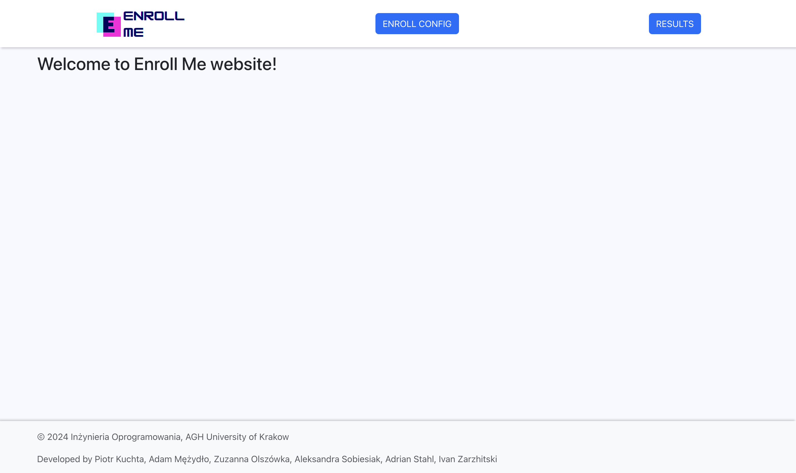
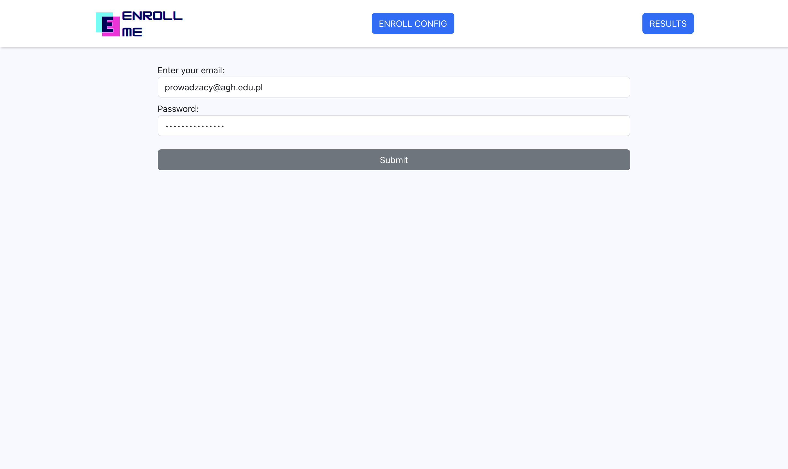
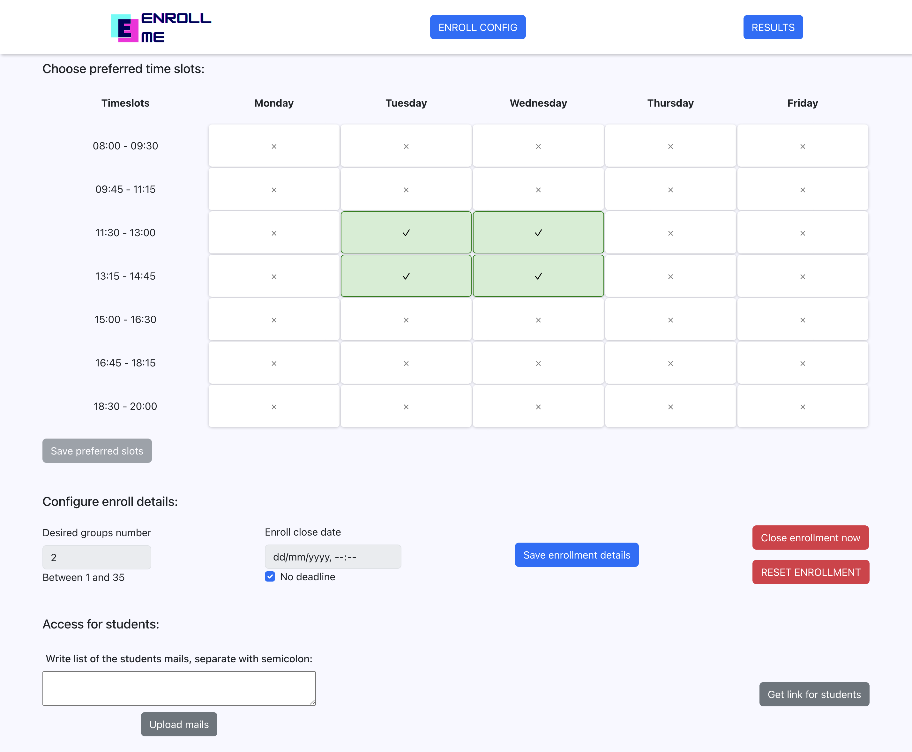
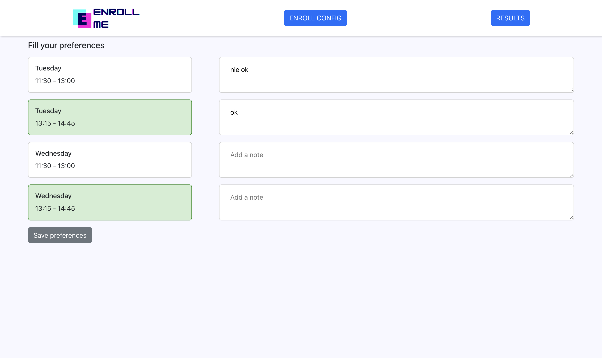

## Compose sample application

### Use with Docker Development Environments

You can open this sample in the Dev Environments feature of Docker Desktop version 4.12 or later.

[Open in Docker Dev Environments ](https://open.docker.com/dashboard/dev-envs?url=https://github.com/docker/awesome-compose/tree/master/react-java-mysql)

### React application with a Spring backend and a MySQL database

Project structure:
```
.
├── backend
│   ├── Dockerfile
│   ...
├── db
│   └── password.txt
├── compose.yaml
├── frontend
│   ├── ...
│   └── Dockerfile
└── README.md
```

[_compose.yaml_](compose.yaml)
```
services:
  backend:
    build: backend
    ...
  db:
    # We use a mariadb image which supports both amd64 & arm64 architecture
    image: mariadb:10.6.4-focal
    # If you really want to use MySQL, uncomment the following line
    #image: mysql:8.0.27
    ...
  frontend:
    build: frontend
    ports:
    - 3000:3000
    ...
```
The compose file defines an application with three services `frontend`, `backend` and `db`.
When deploying the application, docker compose maps port 3000 of the frontend service container to port 3000 of the host as specified in the file.
Make sure port 3000 on the host is not already being in use.

> ℹ️ **_INFO_**
> For compatibility purpose between `AMD64` and `ARM64` architecture, we use a MariaDB as database instead of MySQL.
> You still can use the MySQL image by uncommenting the following line in the Compose file
> `#image: mysql:8.0.27`

## Deploy with docker compose

```
$ docker compose up -d
Creating network "react-java-mysql-default" with the default driver
Building backend
Step 1/17 : FROM maven:3.6.3-jdk-11 AS builder
...
Successfully tagged react-java-mysql_frontend:latest
WARNING: Image for service frontend was built because it did not already exist. To rebuild this image you must use `docker-compose build` or `docker-compose up --build`.
Creating react-java-mysql-frontend-1 ... done
Creating react-java-mysql-db-1       ... done
Creating react-java-mysql-backend-1  ... done
```

## Expected result

Listing containers must show three containers running and the port mapping as below:
```
$ docker ps
ONTAINER ID        IMAGE                       COMMAND                  CREATED             STATUS              PORTS                  NAMES
a63dee74d79e        react-java-mysql-backend    "java -Djava.securit…"   39 seconds ago      Up 37 seconds                              react-java-mysql_backend-1
6a7364c0812e        react-java-mysql-frontend   "docker-entrypoint.s…"   39 seconds ago      Up 33 seconds       0.0.0.0:3000->3000/tcp react-java-mysql_frontend-1
b176b18fbec4        mysql:8.0.19                "docker-entrypoint.s…"   39 seconds ago      Up 37 seconds       3306/tcp, 33060/tcp    react-java-mysql_db-1
```

Stop and remove the containers
```
$ docker compose down
Stopping react-java-mysql-backend-1  ... done
Stopping react-java-mysql-frontend-1 ... done
Stopping react-java-mysql-db-1       ... done
Removing react-java-mysql-backend-1  ... done
Removing react-java-mysql-frontend-1 ... done
Removing react-java-mysql-db-1       ... done
Removing network react-java-mysql-default
```


# Api Docs

[Swagger UI docs](http://localhost:8080/docs) - link to REST API docs

[Swagger UI config](https://www.baeldung.com/spring-rest-openapi-documentation) - short tutorial on how to add description of endpoints and other stuff to the Swagger UI docs

# Client application
After the aplication starts, you can open the client web application under `http://localhost:3000`.
### Home Page

From here, you can navigate to Enroll Configuration Page and Results Page.

### Enroll Configuration Page

The teacher pages are secured with Spring Security basic auth. You need the correct email and password to access those pages.

Here, the teacher can configure the whole enrollment for students:
- Choose the timeslots that he is available at
- Configure enrollment details:
  - The desired number of groups that algorithm is supposed to generate
  - The planned deadline, which also includes sending email remainders to students about the enrollment closing soon
  - He can choose not to set a deadline, and close the enrollment manually
- Student access
  - The teacher can insert student emails for them to be able to fill their preferences
  - Get the link with access for students preferences page (it also starts the enrollment for students)
- He can also reset the application to initial state at any moment

### Student Preferences Page

The page for students is secured with an email access. Only the students who were added to the system can enter.
The page is also blocked when the enrollment is not active.


Here, the student can fill his preferences with possibility to leave a note next to any timeslot.
If a student wants to change his preferences later, he's going to get the existing preferences from the server when returning to this page.

### Results Page
todo: results

# Changelog
## SCRUM-85 (31.03.2024)
### Nowy entity `Enrollment`

- Enrollment przechowuje informacje o liczbie grup, deadlinie, stanie (`EnrollmentState`), a także zawiera 
listę `List<TimeSlot>`, czyli siatkę godzin.

### Zastąpienie `TimetableController` przez `EnrollmentController`

- Zmieniono i dodano nowe endpointy ([Swagger UI docs](http://localhost:8080/docs))
- Teraz aby pobrać siatkę godzin trzeba skorzystać z `GET /enrollment`, a w odpowiedzi
JSON zawiera dodatkowo informacje o liczbie grup, deadlinie i stanie enrolla
- Oddzielono endpointy `GET /taecher/timetable` oraz `POST /teacher/timetable` na:
  * `GET /enrollment` (opisane wyżej)
  * `POST /enrollment/timetable`

### Przeniesienie metod z serwisu `TimetableService` do `EnrollmentService`

- Metody `getTimetable()`, `updateTimetable()`, `updateTimeslots()` są teraz dostępne z `EnrollmentService`
- Metoda `getTimetable()` **nie** jest teraz wykorzysytwana przez żaden kontroler, korzysta z niej jedynie algorytm
i testy algorytmu

### Fix prezentacji godzin

- Usunięto sekundy z godzin we wszystkich DTO dotyczących `Timeslot`, więc frontend dostaje teraz prawidłowy format
- Dla obiektów typu `LocalDateTime` właściwym formatem jest `yyyy-MM-dd HH:mm:ss`

## SCRUM-67 (02.04.2024)
### Dodanie autentykacji

- od teraz na endpointy `/enrollment` i `/enrollment/**` może wejść jedynie użytkownik, który za pomocą
BasicAuth poda w zapytaniu login i hasło:

```
login: miidzik@agh.edu.pl
hasło: I<3Burito
```
- pozostałe endpointy są otwarte dla wszystkich

### Stworzenie klasy `Teacher`

- Klasa Teacher odpowiada typowej klasie User, jednak póki co tylko Teacher się może zalogować

### Usunięcie pola `UserRole` z klasy Student

- klasa student nie potrzebuje już pola typu `UserRole`, w zasadzie klasa `Teacher` również i obecnie zamiana
autoryzacji po roli na autoryzację po autentykacji (każdy zalogowany ma dostęp) niczego nie zmieni

### Modyfikacja obsługi `GET /students`

- zastąpiono 3 metody jedną, która w zależości od liczby i rodzaju parametru wykonuje odpowiednie czynności.
Problemem było głównie OpenApi, które nie pozwalało na przesłanie tylko 1 z parametrów.

### Dodanie `OpenApiConfig`

- Aby poprawnie móc testować autentykację potrzebna była konfiguracja OpenApi
- W przyszłości pewnie warto poprawić i dodać więcej opisów / przykładów
np. przykładowy `PUT /enrollment/timetable` podaje godzinę jako obiekt zamiast napisu.
Aby poprawnie wysłać żądanie należy w przykładzie zmienić godzinę na format `"startTime": "08:00"`.
Ważne jest, że godziny 1-cyfrowe muszą być poprzedzone 0!
